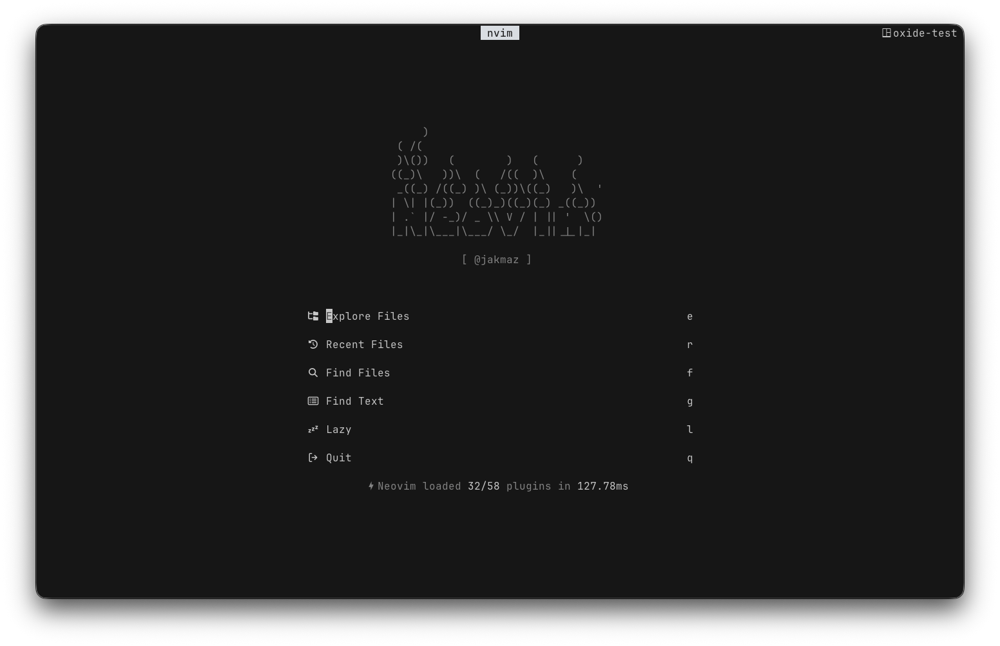
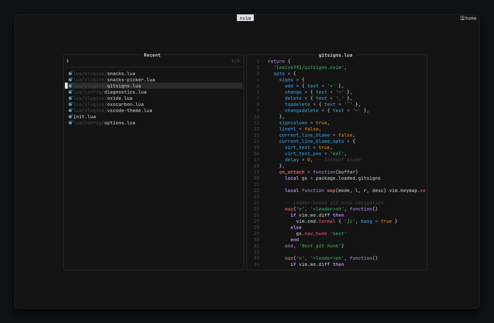
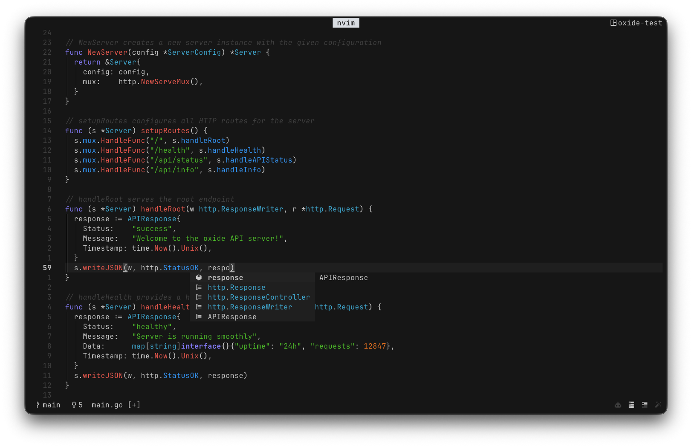
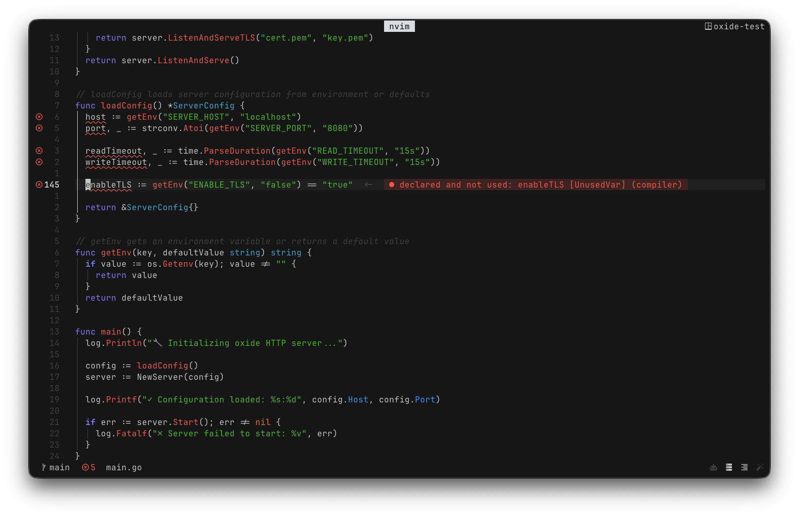

<div align="center">

# oxide

</div>

<h6 align="center">
Where function meets form.
</h6>

<p align="center">
  <a href="https://github.com/oxidescheme/nvim/stargazers"></a>
  <a href="https://github.com/oxidescheme/nvim/issues"></a>
  <a href="https://discord.gg/p8GcbBH5MR"></a>
</p>

<p align="center">
  
</p>

<p align="center">
  
</p>

<p align="center">
  
</p>

<p align="center">
  
</p>

**oxide** brings the oxide colorscheme to [neovim](https://neovim.io) with full [treesitter](https://github.com/nvim-treesitter/nvim-treesitter) and [lsp](https://neovim.io/doc/user/lsp.html) support.

## Features

- Dark theme with Treesitter and LSP semantic highlighting
- Customizable colors and highlight groups
- Lazy-loaded with minimal startup impact
- Built-in lualine theme and growing plugin integration

## Installation

### [vim.pack](https://neovim.io/doc/user/pack) (Neovim 0.12+)

```lua
vim.pack.add({
  {
    src = 'https://github.com/oxidescheme/nvim',
    name = 'oxide',
  },
})

vim.cmd.colorscheme("oxide")
```

### [lazy.nvim](https://github.com/folke/lazy.nvim)

```lua
{
  "oxidescheme/nvim",
  name = "oxide",
  lazy = false,
  priority = 1000,
  config = function()
    require("oxide").setup()
    vim.cmd.colorscheme("oxide")
  end,
}
```

### [packer.nvim](https://github.com/wbthomason/packer.nvim)

```lua
use {
  "oxidescheme/nvim",
  name = "oxide",
  config = function()
    require("oxide").setup()
    vim.cmd.colorscheme("oxide")
  end
}
```

### [vim-plug](https://github.com/junegunn/vim-plug)

```vim
Plug 'oxidescheme/nvim'
```

```lua
require("oxide").setup()
vim.cmd.colorscheme("oxide")
```

## Usage

```lua
-- Basic usage
vim.cmd.colorscheme("oxide")

-- Or use the lua API
require("oxide").load()
```

## Configuration

oxide comes with sensible defaults, but every aspect can be customized:

```lua
require("oxide").setup({
  transparent = false, -- Enable transparent background
  terminal_colors = true, -- Configure terminal colors

  styles = {
    comments = { italic = true },
    keywords = { bold = true },
    functions = {},
    variables = {},
    strings = {},
    booleans = {},
    numbers = {},
  },

  -- Override colors
  on_colors = function(colors)
    colors.red = "#ff0000" -- Make red more intense
  end,

  -- Override highlight groups
  on_highlights = function(highlights, colors)
    highlights.Comment = { fg = colors.green, italic = true }
  end,
})
```

### Configuration Options

| Option | Default | Description |
|--------|---------|-------------|
| `transparent` | `false` | Enable transparent background |
| `terminal_colors` | `true` | Set terminal colors |
| `styles` | `{}` | Style overrides for syntax groups |
| `on_colors` | `nil` | Function to override color palette |
| `on_highlights` | `nil` | Function to override highlight groups |

### Custom Styles

```lua
require("oxide").setup({
  styles = {
    -- Remove all styling
    comments = {},
    -- Make functions stand out more
    functions = { bold = true, italic = true },
    -- Subtle variables
    variables = { italic = true },
  }
})
```

### Integration with Other Plugins

oxide works seamlessly with popular plugins:

- **[lualine](https://github.com/nvim-lualine/lualine.nvim)**
- **[nvim-tree](https://github.com/kyazdani42/nvim-tree.lua)**
- **[telescope](https://github.com/nvim-telescope/telescope.nvim)**
- **[gitsigns](https://github.com/lewis6991/gitsigns.nvim)**
- **[snacks](https://github.com/folke/snacks.nvim)**
- **[flash](https://github.com/folke/flash.nvim)**
- **[render-markdown.nvim](https://github.com/MeanderingProgrammer/render-markdown.nvim)**

## Contributing

PRs welcome. Make sure new highlight groups serve a clear purpose and colors match the palette defined in the codebase.

## Credits

- **Port Creator:** [@jakmaz](https://github.com/jakmaz)
- **Current Maintainer:** [@jakmaz](https://github.com/jakmaz)
- **Contributors:** See [contributors list](https://github.com/oxidescheme/oxide/graphs/contributors)

## License

MIT License - see [LICENSE](LICENSE) for details.

<p align="center">
Copyright &copy; 2025-present oxidescheme
</p>
